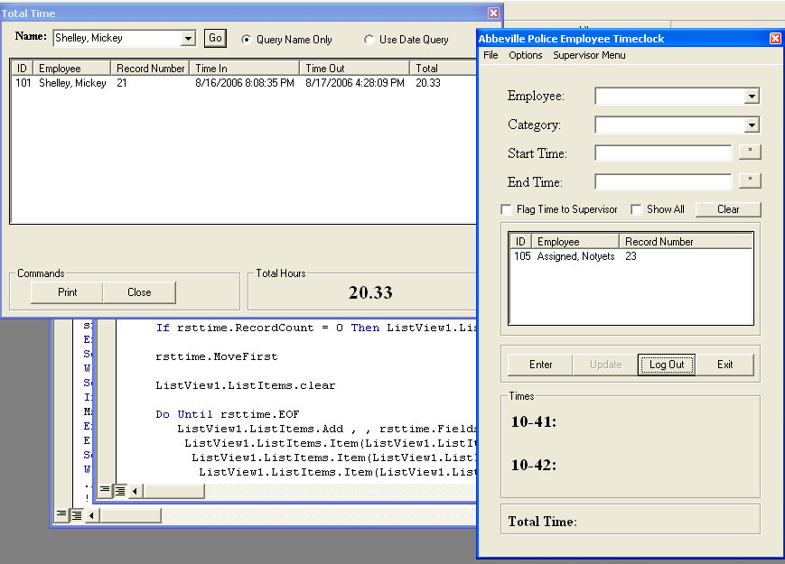



## Advanced Time Clock

### Description

This is a time card program that was made for a local police agency. It uses an ini and is somewhat networkable. It will automatically flag times that are below a certain number of specified hours. This is my first submission so be gentle and PLEASE VOTE
 
### More Info
 

             |
---                |---
**Submitted On**   |2006-08-25 07:07:20
**By**             |[Nicholas Cheek ](https://github.com/Planet-Source-Code/PSCIndex/blob/master/ByAuthor/nicholas-cheek.md)
**Level**          |Intermediate
**User Rating**    |4.3 (13 globes from 3 users)
**Compatibility**  |VB 6\.0
**Category**       |[Complete Applications](https://github.com/Planet-Source-Code/PSCIndex/blob/master/ByCategory/complete-applications__1-27.md)
**World**          |[Visual Basic](https://github.com/Planet-Source-Code/PSCIndex/blob/master/ByWorld/visual-basic.md)
**Archive File**   |[Advanced\_T2015848252006\.zip](https://github.com/Planet-Source-Code/nicholas-cheek-advanced-time-clock__1-66377/archive/master.zip)

